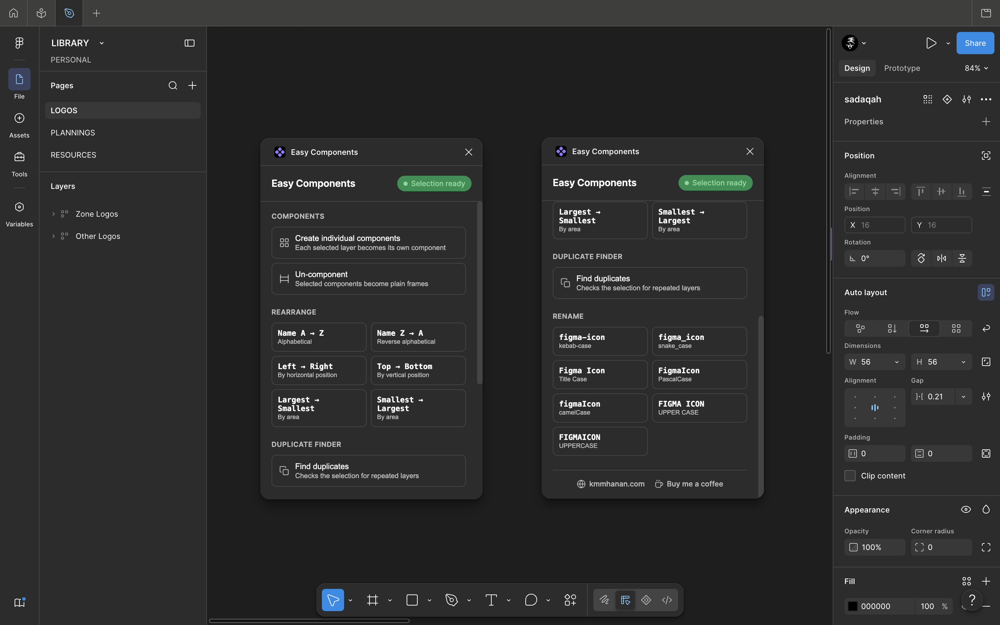

# 🧩 Easy Components

**Five small fixes for the Figma component/layer workflows the native tools make awkward.**

[Features](#-features) · [How it works](#-how-it-works) · [Install](docs/INSTALL.md) · [Build](docs/BUILD.md) · [Change the icon](docs/ICON.md) · [Publish](docs/PUBLISH.md)

---

## 🤔 The problem

Figma's own tools have a few gaps around components and layer hygiene:

- Selecting several layers and hitting **Create Component** can bundle them
  into one merged component instead of giving each its own.
- There's no built-in way to turn a component back into a plain frame.
- Reordering more than a couple of layers by name, position, or size means
  dragging them one at a time in the Layers panel.
- Renaming a batch of layers into a consistent format (`kebab-case`,
  `camelCase`, etc.) means doing it by hand, one layer at a time.
- Finding accidental duplicate layers in a big selection is basically
  eyeballing it.

**Easy Components** is five small, focused tools for exactly these gaps —
no persistent state, no setup, just select some layers and click a button.

## ✨ Features

### 🧱 Create individual components

Select several layers and each one becomes its **own** separate component —
not one component containing all of them. Works on frames, groups, and
loose shapes/vectors/text alike (leaf nodes get wrapped, matching what
Figma's own UI does for a single shape). Instances are detached first so
you're componentizing a plain copy, not the live instance.

### 🖼️ Un-component

Select one or more components and convert them straight back into plain
frames — something Figma's native UI has no button for at all. Any
existing instances of that component will lose their link, same as
deleting a component normally would; the plugin tells you exactly how many
were affected.

### 🔀 Rearrange

Sort the selected layers by:

| Option             | Effect                 |
| ------------------ | ---------------------- |
| Name A → Z         | Alphabetical           |
| Name Z → A         | Reverse alphabetical   |
| Left → Right       | By horizontal position |
| Top → Bottom       | By vertical position   |
| Largest → Smallest | By area                |
| Smallest → Largest | By area                |

Non-selected siblings keep their exact position — only the layers you
selected get re-sequenced among the "slots" they already occupy.

### 🔡 Rename

Batch-convert selected layer names into a consistent naming convention.
Given a name like "Figma icon", it can produce any of:

| Format     | Example      |
| ---------- | ------------ |
| kebab-case | `figma-icon` |
| snake_case | `figma_icon` |
| Title Case | `Figma Icon` |
| PascalCase | `FigmaIcon`  |
| camelCase  | `figmaIcon`  |
| UPPER CASE | `FIGMA ICON` |
| UPPERCASE  | `FIGMAICON`  |

It detects word boundaries from existing separators (space, `-`, `_`, `.`)
_and_ camelCase/PascalCase transitions, so it can freely re-convert between
any of the formats above, in either direction — round-trip as many times as
you like.

**One limitation, by design:** a name with no separator and no case
transition at all — like `figmaicon` or `FIGMAICON` — has no recoverable
word boundary. For those, the tool can only toggle between all-lowercase
and all-UPPERCASE; there's no way to guess where "figma" ends and "icon"
begins.

### 🔍 Duplicate finder

Checks the current selection for layers that look like accidental
duplicates (same type, name, and size) and lists each group with a count.
Two follow-up actions:

- **Select all duplicates** — selects every layer in every group, for a
  quick visual review.
- **Select extras only** — keeps the first layer of each group untouched
  and selects just the redundant copies, ready to delete in one go.

## 🧠 How it works

Every action in this plugin operates directly on `figma.currentPage.selection`
and applies immediately — there's no template list or saved state to manage,
so the panel stays out of your way between actions.

## 📸 Screenshot

## 🚀 Getting started

- **Just want to use it?** → [`docs/INSTALL.md`](docs/INSTALL.md)
- **Want to build or modify it?** → [`docs/BUILD.md`](docs/BUILD.md)
- **Changing the plugin icon?** → [`docs/ICON.md`](docs/ICON.md)
- **Publishing a new version?** → [`docs/PUBLISH.md`](docs/PUBLISH.md)

## ⚠️ Notes / limitations

- Un-componenting breaks the link for any existing instances of that
  component — same consequence as deleting a component in Figma's own UI.
- Variant sets (`COMPONENT_SET`) and Sections are skipped by "create
  individual components" — componentizing a whole variant set isn't a
  meaningful single-node operation.
- Duplicate detection compares type, trimmed name, and rounded size — it
  doesn't inspect fills or nested content, so two differently-styled layers
  that happen to share a name and size will still show up as "duplicates."
- Network access is disabled in the manifest — everything runs locally.

## 🤝 Contributing

Issues and PRs welcome. Please run `npm run typecheck` before submitting.

## 📄 License

MIT © [Kmm Hanan](https://kmmhanan.com) — see [LICENSE](./LICENSE).
